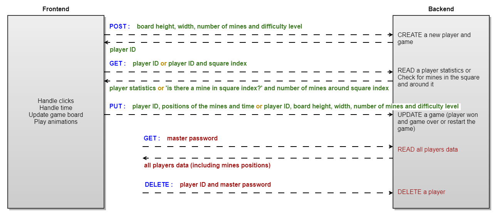

# Minesweeper

Minesweeper was one of the first PC games I played. When I was a child, in the '90s, I remember going to the supermarket, stopping at the computer sector and asking for the password so I could play the games that came installed on Windows while my parents went shopping. When I finally got my first Windows 95 PC I mainly played demo versions and the free games that came with the computer, like solitaire, pinball and minesweeper. The latter stick with me for a few years, whenever I needed to wait midnight to connect to the internet or download a 7 MB file using dial-up, there I was playing minesweeper.

The game is pretty straightforward: there is a field with several hidden mines and you must find them by opening all squares that do not have one. As a clue, when opened, each square that does not have a mine will show the number of mines in the 8 squares around it. If you are good at math and learn to identify some patterns in the squares, you will win the game easily, at least in the early levels.

## Introduction

This project was developed using React JS, Express and MongoDB with the objective of practicing and assimilating knowledge acquired in the frontend and backend courses from Sansumg Ocean, given by professor [Paulo Salvatore](https://github.com/paulosalvatore) on December 2020. The following content will describe the project, the technical choices and some options for future implementations, feel free to reach me with your feedbacks or questions at marcus.lagana@gmail.com

## Description

The application was divided into a front and a backend.
The backend stored the mines positions, the player ID, its best time and other statistics; and the frontend took care of the logic of the game.
They exchanged data following the diagram bellow:

<p align="center">
  
</p>

## Backend

The backend is a RESTful API built using Express.
After the development and tests of the API, a catchall endpoint was created to redirect any request to the frontend part of the application. This way, both parts could be hosted together.

### The Endpoints


### Configuring the environment
1. Create a new folder for the project, open the terminal in that folder and type **`npm init`**.
2. Follow the intructions to create the ***package.json*** file. You can always edit it latter and change its content.
3. Install **express**, wich will be used to create the API: **`npm install express`**
4. Install **nodemon** as a development dependency, which will be used to restart the development server whenever any project file is updated and saved: **`npm install nodemon -D`**
5. Open the ***package.json*** file and insert a development script as shown below (don't forget to add a comma at the end of the test script line):
```json
"scripts": {
    "test": "echo \"Error: no test specified\" && exit 1",
    "dev": "nodemon index"
  },
```
6. Create a new file: ***index.js***
7. Fill ***index.js*** with the following minimal code:
```js
const express = require('express');

const port = 5000;

const app = express();

app.get('', async (req, res) => {
    res.send({msg: 'Hello World'});
});

app.listen(port, () => {
    console.log(`App running on http://localhost:${port}`);
});
```
8. Run the server by typing **`npm run dev`** in the terminal and access the API at (http://localhost:5000). `{"msg": "Hello World"}` shall be displayed.

**Summary**
On steps 1 and 2, **node** was installed and the file ***package.json*** of the project was created, which is responsible for configuring **node** and managing all installed packages. Then **express** and **nodemon** were installed, **express** being the package used to create the API and **nodemon** the one that will restart our server with every file change during the development. On step 5 the development script (used to run the server) was created, and then the first javascript file was created and the server was started and tested.

For now, the app

### Creating the endpoints
